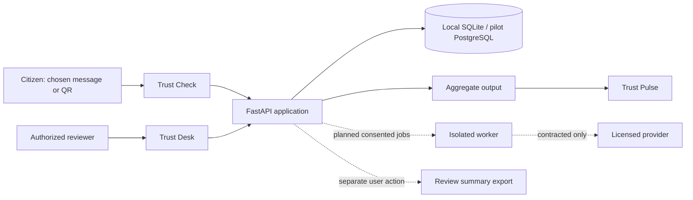

# Architecture and data boundaries

Status: implementation baseline plus explicitly marked pilot target. 9 September 2026.

## 1. Decision

Use a modular monolith: one FastAPI application and one ES-module browser application, with logically separate checking, consent, reports, review and aggregation modules. The existing SQLite adapter is suitable for a local prototype, not the proposed multi-tenant service. Introduce a worker process only for provider/image jobs that need bounded execution. A container deployment is supported by the framework's official guidance [S8].

## 2. Context



Solid paths describe the local architecture. Dotted paths are planned or explicitly user-controlled. The diagram does not imply external access is configured.

## 3. Implemented boundaries

Browser input is untrusted. Requests are size-capped, typed and origin-limited; local throttling bounds abuse but is not distributed enforcement. `/api/scans` performs passive analysis, discards the original message, stores a minimized result in memory for 15 minutes, and returns a scoped bearer capability. The check cannot be retrieved by ID alone. Capability hashes are held by the server; browser tokens must not be placed in URLs, analytics, logs or local storage.

Images are optionally redacted in the browser and sent as PNG/JPEG bytes to the local QR decoder only after an explicit action. Bytes are processed in memory and not saved. This is QR decoding, not screenshot text extraction. The native decoder is not yet an isolated production worker.

`POST /api/reports` requires the check capability, separate consent and a fixed consent version. The database stores minimized indicators, rule codes and case metadata; it does not store original messages or screenshot files. Domain names and keyed identifier fingerprints can still be sensitive or identifying; minimization is not anonymity. Reports expire after 30 days in the starter's purge policy. Minimal audit records have a separate 90-day policy. These are engineering defaults, not legal retention advice.

The reviewer key cannot substitute for the separate Pulse key. Reviewed associations indicate co-occurrence, not criminal attribution. Pulse suppresses category counts below five and suppresses a total when it would expose suppressed cells. This does not prevent every differencing attack: a fixed, reviewed publication system is a pilot requirement.

## 4. Current API inventory

| Endpoint | Access | Behavior |
|---|---|---|
| GET /api/health | Anonymous | Local health and disabled external-provider indicators |
| GET /api/capabilities | Anonymous | Honest implemented/planned capability manifest |
| POST /api/scans | Anonymous, rate limited | Passive check with expiring capability |
| GET/DELETE /api/scans/{id} | Check capability | Retrieve/forget minimized transient result |
| POST /api/qr/decode | Anonymous, bounded image | Decode only; user confirms returned text |
| POST /api/reports | Check capability + consent | Create minimized pending report |
| DELETE /api/reports/{id} | Withdrawal capability | Remove report and observations |
| GET /api/scans/{id}/export | Check capability | Summary ZIP; no official complaint is filed |
| GET /api/analyst/reports | Local reviewer key | Bounded review inbox |
| PATCH /api/analyst/reports/{id} | Local reviewer key | Accept/reject relevance with a reason |
| GET /api/analyst/graph | Local reviewer key | Reviewed co-occurrence relationships |
| GET /api/pulse | Separate aggregate key | Suppressed categories; separate demo cohort |

Consult `/api/openapi.json` and implementation for the authoritative request/response schemas. The proposed `/v1` API is not shipped as a second working API.

## 5. Pilot deployment target

One TLS origin serves the web app and API. Use PostgreSQL with migrations, explicit tenant ownership on every case and a least-privileged application identity. Add named OIDC identities and MFA for staff; avoid custom password authentication. Use a durable queue for extraction/reputation jobs. An outbox/idempotency key ties jobs to consented checks; retries have attempt limits, deadlines and an unavailable outcome. Queue visibility never grants access to evidence in another tenant.

If original images must be retained for a documented purpose, use private object storage, short-lived scoped upload/download links, encryption/key management, metadata stripping and enforced expiry. A user-approved derivative and an original artifact need distinct provenance. A content hash protects integrity after collection; it does not prove an image is authentic. Do not store originals merely because storage is cheap.

No provider key goes to the browser. A provider interface returns status, evidence source, timestamp, expiry and license scope. No result or timeout becomes a safe verdict. Cache only within contract terms. No full URL containing a token or personal data is sent externally without a deliberate minimization/consent decision. Safe Browsing and VirusTotal public API restrictions require commercial licensing review [S5, S6]; Web Risk is one candidate, not an implemented integration [S4].

## 6. Data model and state machines

Target entities: tenant; membership; check; consent_event; evidence; indicator; observation; assertion; report; review_decision; relationship_hypothesis; publication_snapshot; audit_event. Distinguish a submitted allegation from a reviewed assertion with an expiry and supporting source. An account identifier is not proof of a person's identity.

```text
check: accepted -> processing -> complete | partial | unavailable -> expired
report: pending -> accepted_for_review | rejected -> corrected | withdrawn | expired
assertion (planned): proposed -> corroborated -> published | rejected -> expired/retracted
snapshot (planned): prepared -> disclosure_reviewed -> published -> superseded
```

The starter implements only part of these states; `accepted` currently means relevant to review. It is not a finding that an indicator is malicious.

## 7. Security and operational targets

Do not fetch arbitrary submitted URLs. Future retrieval would need isolation and egress rules; the default MVP deliberately avoids the problem. Never execute submitted code, open attachments as programs, scrape private chats, or expose identity lookup. Extraction models receive data, not authority; they cannot browse, change policy, send messages or adjudicate guilt.

Before a network pilot: named identities, tenant access tests, upload worker isolation, distributed throttles, provider contracts, retention jobs, tested restore, redacted logs, correction procedures, rate/cost budgets and a withdrawal policy. Backups require deletion/expiry handling too. Do not infer client identity from untrusted forwarded headers. Target pilot recovery objectives must be selected with the customer and tested, not promised from architecture alone.

## 8. Explicit non-goals

No native mobile apps, blockchain, Kubernetes, graph database cluster, automatic nationwide collection, account-owner verification, payment execution, funds freeze or national surveillance dashboard. Partner integrations and government hosting require actual agreements. National expansion follows demonstrated user value and operating capacity, not a diagram.
