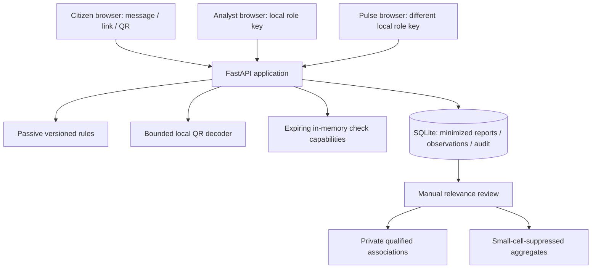
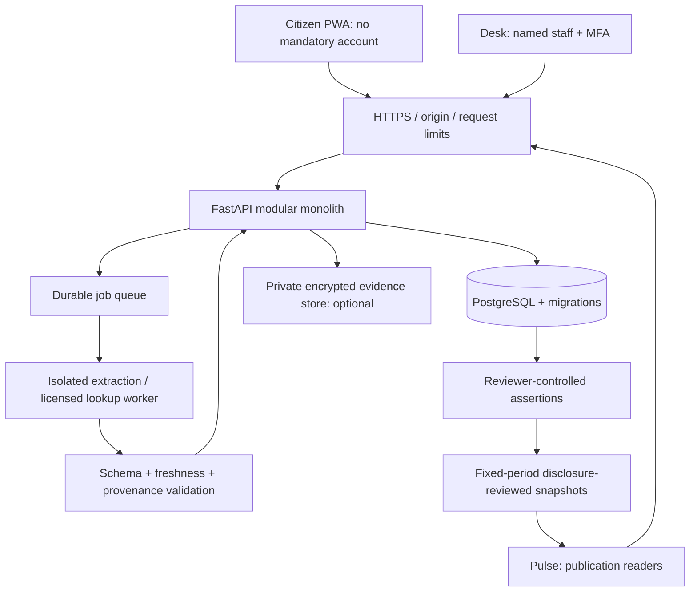

# Architecture — current implementation and target pilot

## 1. Scope and design decision
One FastAPI application serves static browser modules and API routes. This deliberately small foundation lets one human founder with AI assistance understand and change the whole codebase. It is a local, defensive evidence-intake prototype. Neither the product nor this specification grants authority to collect third-party data or conduct surveillance.

The three interfaces have separate purposes: Check helps a person pause; Desk helps an authorized team assemble and review a case; Pulse helps an institutional reader understand bounded aggregate patterns. The target is a useful intake workflow, not a nationwide criminal-identity graph.

## 2. Current containers

No submitted URL is opened. No external provider is enabled. Browser redaction modifies a local copy; explicit QR decoding sends that selected copy to the local backend. Screenshot text extraction is not implemented. Three secrets are generated on the developer machine. API responses use no-store; the service worker caches the static shell only.

The QR parser is an ASCII-only EMV-style subset. Structural integrity is not recipient authenticity; a valid CRC is not proof of trust. NBC supplies KHQR integration resources, but integration compatibility is a future evaluation gate. [S4]

## 3. Target pilot containers — not implemented

Deploy one application container and one worker where necessary, not a fleet of services. Prefer managed PostgreSQL and private object storage for a controlled pilot; hosting jurisdiction, contracts and cross-border processing are decisions to approve, not assumed compliance. Keep a separate staging environment with synthetic data. A bank, police, CamDX or authentication integration requires a specific authorized interface and contract; none is required to prove the intake workflow.

## 4. Modules and responsibilities
| Module | Current responsibility | Pilot extension |
|---|---|---|
| `app/main.py` | request limits, local authorization, scan/report/export routes | versioned API, named identity, organization scope |
| `app/engine.py` | bounded passive rules and evidence-backed warnings | source-qualified assertions, expiry, consistent partial results |
| `app/qr.py` | raster decoding and limited structure inspection | official specification/SDK compatibility evaluation |
| `app/storage.py` | minimized SQLite reports and review | repository adapter over PostgreSQL migrations |
| `app/providers.py` | disabled adapter contracts | approved licensed provider with deadlines and quotas |
| `app/capabilities.py` | honest implementation manifest | deployment-specific feature availability |
| `app/static/` | responsive UI, redaction, report receipt | user-confirmed extraction, accessible localized flows |

## 5. Data model and trust boundary
Separate **check**, **consent**, **evidence**, **observation**, **assertion** and **publication**. A report records a user's submission; an assertion records a time-limited reviewed claim supported by a source. A match is not ownership attribution. Sensitive keyed fingerprints are pseudonymous, not anonymous.

Current reports retain category, channel, rule codes, verdict, consent version, expiry, a deletion-token hash and minimized indicators. Original messages/images are not written to the database. Domain labels may still contain sensitive information; future real data needs a tested policy and data mapping. Full telephone numbers, bank account IDs and QR account fields must not leak through exports or telemetry.

Target entities: organizations; users/memberships; checks/jobs; consent events; private evidence; indicators/observations; reviewed assertions; relationship hypotheses; audit events; publication snapshots. Tenant identifiers and authorization must be enforced at every private route and asynchronous job, including exports. A SQL sketch is not enforcement.

## 6. Lifecycle and interfaces
Current: `POST /api/scans` → immediate result, opaque ID and expiring bearer capability. A separate `POST /api/reports` requires that capability and explicit consent. Only a specific analyst key can review reports; only the different Pulse key can read aggregates. A deletion receipt authorizes withdrawal. Capabilities must never appear in URLs or logs.

Target image/provider jobs: `POST /v1/checks` returns 202, then `GET /v1/checks/{id}` returns pending/complete/partial/unavailable. User-approved uploads have size/type limits. Jobs use idempotency keys, bounded attempts, execution deadlines and an outbox/retry design that avoids duplicate reports. A failed provider produces unknown/partial, never reassuring green.

No automatic police submission. An exported packet is a user-reviewed summary, not a formal complaint, forensic original or legal chain-of-custody certificate. The official complaint portal remains separate. [S5]

## 7. Access matrix
| Role | Check own result | Own report receipt | Tenant cases | Assertions | Approved aggregates |
|---|---|---|---|---|---|
| Anonymous submitter | scoped capability | scoped receipt | no | no | no |
| Desk analyst | assigned scope | policy-controlled | own tenant | propose | own permitted view |
| Reviewer | authorized scope | policy-controlled | own tenant | review with evidence | own permitted view |
| Pulse reader | no | no | no | no raw records | approved snapshot only |
| Operations | health/quotas | no default evidence access | no default access | no | infrastructure metrics |

This table is the target, not a claim that static development keys implement these roles. Break-glass access needs a purpose, expiry and audit review.

## 8. Security and abuse controls
Treat messages, screenshots and QR payloads as untrusted data. Do not execute attachments, HTML or instructions embedded in an image. An optional extraction model has no tools, browsing authority or authority to determine guilt. Show extracted identifiers for user correction; preserve confidence and provenance.

Prevent report brigading through bounded intake, private review and no vote-count scoring. Provide a correction path before publishing claims. Prevent cost abuse with per-provider budgets, short deadlines, bounded queues and a circuit breaker. Prevent export leaks with access tests and minimal schemas. Do not add arbitrary webpage retrieval; any later requirement needs a separate threat-model review, not a shortcut in the API. [S8]

For production Pulse, use fixed publication windows and approved aggregates, not repeatedly filterable live counts. Small-cell suppression alone does not prevent differencing or guarantee anonymity. Do not display precise locations, raw identifiers or unrepresentative national prevalence claims.

## 9. Retention, operations and observability
Local policy: checks expire after 15 minutes, reports after 30 days, minimal audit events after 90 days. Purge occurs on selected operations and through `scripts/purge.py`; an unattended retention scheduler is not implemented. In-memory checks are lost on restart. The local database is not encrypted by this app and is not multi-instance safe.

Pilot targets, not measured guarantees: rule-only p95 under 2 seconds; interactive extraction p95 under 15 seconds; recovery-point objective 24 hours; recovery-time objective 4 hours; initial business-hours support only. Benchmark on selected hosting and record failure modes. Keep logs to request IDs, error classes, durations and provider status, without payloads, secrets or identifying paths.

Before real evidence: encrypted backups; restore drill; deletion tests including object lifecycle and backup policy; dependency/license review; staff access review; monitoring alerts; documented incident handling and an off switch for external providers. No 24/7 SLA is promised by a one-founder project.

## 10. Recorded decisions
ADR-001: modular monolith / browser modules until measured need. ADR-002: evidence-based warning states, no numerical scam probability. ADR-003: citizen checking and reporting are separate. ADR-004: no arbitrary target fetch. ADR-005: relationships are hypotheses, synthetic datasets remain separate. ADR-006: live provider access is approval-gated. ADR-007: aggregate publication is a separate future permission boundary. ADR-008: repository and proof-of-impact claims must remain free of personal evidence and fabricated results.

See [sources](SOURCES.md), [evaluation](EVALUATION.md) and [release gates](RELEASE_GATES.md).
